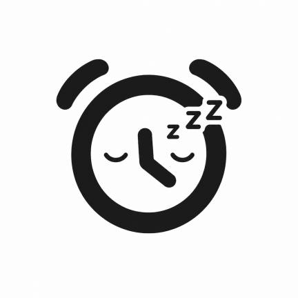
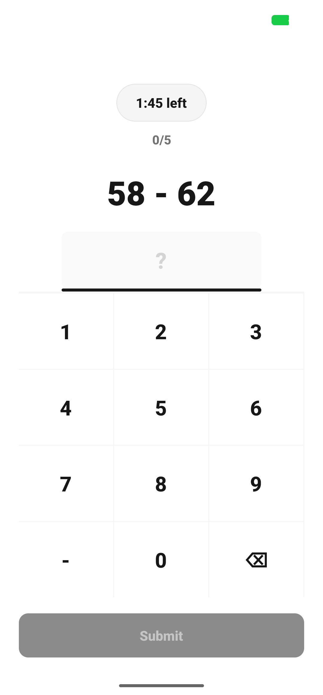

# SleepyFace

<p align="center">
  
</p>

<p align="center">
  <a href="https://play.google.com/store/apps/details?id=com.team5.sleepyface">
    
  </a>
  <a href="https://github.com/keee0053/sleepy-face/actions/workflows/code-quality.yml">
    
  </a>
</p>

寝顔写真を撮るまで鳴り止まない目覚ましアプリです。起床チャレンジ(顔認証→クイズ)に失敗すると、寝起きの顔写真が友達のフィードに公開されます。

## 概要

- アラームは、寝顔写真(Face Proof)を撮影するまで鳴り続けます(Androidの`AlarmManager`を使った正確な時刻起床)
- 写真を撮らずに時間切れになった場合は、その日1日フレンドのフィードが見られなくなります
- 写真撮影後のクイズに失敗すると、寝起きの写真がフレンドのフィードに投稿されます
- 友達同士で「起こす」(相手のアラームを遠隔で鳴らす)「助けて」(寝坊しそうなときに友達に通知を送る)といった、助け合いの機能もあります

## 主な機能

- **アラーム管理**: 時刻・曜日ごとの繰り返し・アラーム音の設定
- **起床チャレンジ**: 前面カメラでの顔写真撮影(Android ML Kitによる顔検出)→クイズ回答
- **フレンドフィード**: 友達の起床結果(成功/失敗)の閲覧、リアクション・コメント
- **フレンド機能**: 友達申請・承認、「起こす」「助けて」
- **プロフィール**: 表示名・アイコン(プリセット or カスタム写真)の設定

## 画面

<p align="center">
  
</p>

## 対応プラットフォーム

- **Android**: 全機能に対応。[Google Play で公開中](https://play.google.com/store/apps/details?id=com.team5.sleepyface)(2026年10月3日公開)
- **iOS**: AlarmKit(iOS 26 以降)によるアラームと Vision フレームワークによる顔検出を別ブランチ([`feature/ios-alarm-face-flow`](https://github.com/keee0053/sleepy-face/tree/feature/ios-alarm-face-flow))で実装し、実機で動作確認済みです。App Store での配信とプッシュ通知には有料の Apple Developer Program への登録が必要なため、現時点では配信しておらず、プッシュ通知を使う友達機能も未対応です

## 技術スタック

- **フロントエンド**: Expo (React Native) / TypeScript / Expo Router(ファイルベースルーティング)
- **バックエンド**: Supabase(Postgres、Auth、Storage、Edge Functions、Row Level Security)
- **ネイティブ機能**: Kotlinで実装したカスタムExpo Module(`AlarmManager`による正確なアラーム鳴動・全画面通知・端末起動時の再同期、ML Kit Face Detectionによる顔検出)
- **テスト**: Vitest によるユニットテスト、ESLint/Prettier によるコード品質チェック(コミット時・CI時に自動実行)

## アーキテクチャ上の特徴

- アラームは「鳴動のたびに翌回分を再スケジュールする」one-shot方式で実現しており、再スケジュールの失敗を検知してリトライ・再同期する仕組みを備えています
- Supabase側は`security definer`なPostgres RPC関数と Row Level Security を組み合わせ、フレンド関係の改ざんを防ぐトリガー等でサーバー側のデータ整合性を担保しています

## 開発体制と個人で担当した改善

このアプリは4名のチームで開発し、その後このリポジトリで個人開発を続けています。個人開発では主に次を実装・改善しました。

- 友達のアラームを遠隔で鳴らす機能とバックエンド
- 日本語・英語の多言語化、モデレーション、アカウント・コンテンツ削除
- 失敗写真の14日後自動削除とStorageのアクセス制御
- アラームの再スケジュール、リトライ、再同期による鳴動の信頼性改善
- Row Level SecurityとPostgres関数の権限検証、データ整合性の改善
- フィード取得件数の制限とインデックス追加によるパフォーマンス改善

共同開発者と各人の貢献は[Contributors](https://github.com/keee0053/sleepy-face/graphs/contributors)から確認できます。

## セットアップ

```bash
npm install
npx expo start
```

Android/顔検出・ネイティブアラーム機能はExpo Goでは動作しないため、Androidの開発ビルド(`expo-dev-client`)でのみ検証できます。

### コード品質チェック

```bash
npm test          # ユニットテスト
npm run lint       # ESLint
npm run format:check
```

## クレジット

プリセットプロフィールアイコンなど、サードパーティ素材のクレジットは [`docs/attributions.md`](./docs/attributions.md) に記載しています。
